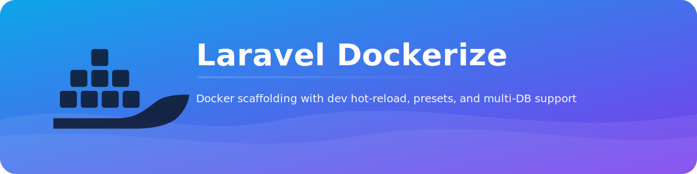

# Laravel Dockerize

<p align="center">
  
</p>

A Laravel-specific Docker scaffolding installer tailored for Laravel apps with production/dev/local presets.

## Requirements

- Laravel 10 or 11
- PHP 8.1+
- Docker Engine and Docker Compose v2
- Node 18+ (recommended 20) for Vite

## Features

- Production-ready PHP-FPM + Nginx multi-stage build.
- Dev and Local presets with hot-reload, Vite container, Xdebug toggle.
- Postgres (main + logs) and Redis with healthchecks.
- Horizon worker container for queues.
- Simple `php artisan dockerize:install` installer.

## Installation

```
composer require --dev rfpdl/laravel-dockerize
```

Install as a dev dependency so it isn't shipped to production images by default. After scaffolding, you can keep the package for future updates or remove it—the generated Docker files stay in your repo.

## Usage

```
php artisan dockerize:install --preset=all                # local|dev|prod|all
php artisan dockerize:install --preset=local              # hot reload + vite + xdebug
php artisan dockerize:install --preset=dev                # team dev stack
php artisan dockerize:install --preset=prod               # production-like

# Choose database backend (default: pgsql). Supported: pgsql | mysql | mariadb
php artisan dockerize:install --preset=local --db=pgsql
php artisan dockerize:install --preset=local --db=mysql
php artisan dockerize:install --preset=local --db=mariadb
```

Then:

- Merge `.env.docker.example` into your `.env`.
- Start: `docker compose -f docker-compose.local.yml up -d` (or dev/prod).

## Highlights

- Laravel-first: artisan-aware entrypoints, migrations, caches.
- Vite container for front-end dev.
- Horizon worker baked in.
- Safer defaults, healthchecks, least-privilege settings.
- Clear presets and .env template.

## Package lifecycle and updates

- The package is auto-discovered via a Service Provider, but it only registers console commands and does nothing at runtime. It’s safe to keep as a dev dependency.
- Plan: add `php artisan dockerize:update` to re-sync template changes (with a diff/confirm prompt). Until then, re-run `dockerize:install --force` if you want to overwrite templates.

## Roadmap

- MySQL/MariaDB optional preset.
- Sail compatibility shim (optional).
- Makefile helpers.
- Interactive installer flags.

## License

MIT
